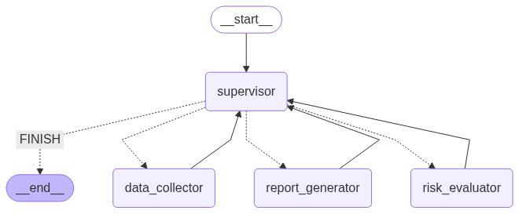

# 🚀 LangGraph와 로컬 LLM을 활용한 자율 대출 심사 시스템

## 2. 프로젝트 목표

**💡핵심 목표:** 복잡한 비즈니스 프로세스를 여러 전문 에이전트의 협력으로 해결하는 자율 시스템 구축 가능성을 탐구합니다. 특히, Supervisor(감독관) 에이전트가 각 하위 에이전트의 작업을 조율하고 전체 워크플로우를 관리하는 과정을 통해, 실제 비즈니스 문제에 적용할 수 있는 에이전트 기반 자동화 패턴을 제시합니다.
<br>

**사용 기술**

   

## 3. 🧑‍💻 팀원

<table align="center">
<tr>
<td align="center" width="200px">

<br/><b><a href="https://github.com/naisksh32" target="_blank">김성현</a></b><br/>🔸 팀장<br/>
<i>LLM & Prompt</i>
</td>
<td align="center" width="200px">

<br/><b><a href="https://github.com/kimsw99" target="_blank">김성욱</a></b><br/>🔸 팀원<br/>
<i>Backend</i>
</td>
<td align="center" width="200px">

<br/><b><a href="https://github.com/10mm-notebook" target="_blank">민지수</a></b><br/>🔸 팀원<br/>
<i>Frontend</i>
</td>
<td align="center" width="200px">

<br/><b><a href="https://github.com/dev-hojun-yoon" target="_blank">윤호준</a></b><br/>🔸 팀원<br/>
<i>Backend</i>
</td>
</tr>
</table>

## 4. 🎯 프로젝트 핵심 기능 (Features)

1.  **🧠 자율적 워크플로우:** 사람의 개입 없이 대출 신청 건에 대한 데이터 조회, 신용 평가, 결과 리포트 전송까지 종단 간(End-to-End) 프로세스를 자율적으로 수행합니다.

2.  **🤖 다중 에이전트 협업:** 중앙 `Supervisor` 에이전트가 `DataCollector`, `LoanReview`, `ReportSender` 등 역할이 명확히 구분된 작업자 에이전트에게 작업을 동적으로 위임하고 전체 프로세스를 조율합니다.

3.  **🧩 모듈식 및 확장 가능한 구조:** 대출 심사 로직은 `mcp_server.py`에 캡슐화되어 에이전트의 판단 로직과 분리됩니다. 새로운 심사 기준이나 데이터 소스가 추가되어도 에이전트 코드 변경을 최소화할 수 있습니다.

4.  **💻 로컬 LLM 연동:** Ollama를 통해 로컬 환경에서 `qwen3:8b` 모델을 구동하여, 외부 API 의존성 및 데이터 유출 위험 없이 시스템을 운영할 수 있습니다.

5.  **⚙️ 유연한 실행 모드:** 단일 건을 상세히 처리하는 `대화형(interactive)` 모드, 여러 건을 빠르게 처리하는 `일괄(batch)` 모드 등 다양한 실행 옵션을 제공합니다.

## 5. 🏗️ 아키텍처 및 워크플로우

이 시스템은 대출 심사 프로세스를 상태 기반 그래프(State Graph)로 모델링하여 각 단계를 체계적으로 관리합니다. 전체 시스템은 `mcp_server`와 `agent` 두 부분으로 구성됩니다.

### 1) 🗺️ 아키텍처 개요



### 2) 🧩 주요 구성 요소 및 역할

1.  **🌐 mcp_server (FastMCP 기반):**
    대출 심사에 필요한 핵심 비즈니스 로직과 데이터를 관리하는 백엔드 서버입니다. 신청자 정보 조회, 신용 평가 점수 계산, 최종 승인/거절 결정 등의 기능을 도구(Tool) 형태로 제공합니다.

2.  **🧠 Supervisor (감독 에이전트):**
    워크플로우의 두뇌 역할을 합니다. 현재 상태(어떤 정보가 수집되었고, 어떤 평가가 끝났는지)를 파악하여 다음에 실행할 최적의 작업자 에이전트를 결정하고 작업을 지시합니다.

3.  **📊 DataCollector (데이터 수집 에이전트):**
    `Supervisor`의 지시를 받아 `mcp_server`로부터 특정 신청자의 상세 정보(소득, 부채, 신용 점수 등)를 조회하는 임무를 수행합니다.

4.  **⚖️ LoanReview (대출 심사 에이전트):**
    수집된 데이터를 바탕으로 `mcp_server`의 평가 도구를 호출하여 대출 승인 여부, 심사 점수, 주요 사유 등을 종합적으로 평가합니다.

5.  **✉️ ReportSender (결과 보고 에이전트):**
    모든 심사가 완료되면, 최종 결과를 요약하여 이메일로 발송하는 작업을 시뮬레이션합니다.

### 3) 🎬 워크플로우 시나리오

1.  **프로세스 시작:**
    사용자가 `main.py`를 통해 특정 신청자 ID(예: `A001`)에 대한 심사를 요청합니다.
2.  **작업 분배:**
    `Supervisor` 에이전트가 요청을 분석합니다. 현재 아무 정보가 없으므로, `DataCollector`에게 신청자 정보 조회를 지시합니다.
3.  **데이터 수집:**
    `DataCollector`가 `mcp_server`에 `A001`의 정보를 요청하고, 결과를 `Supervisor`에게 보고합니다.
4.  **심사 수행:**
    `Supervisor`는 정보가 수집된 것을 확인하고, 이제 `LoanReview` 에이전트에게 대출 평가를 지시합니다.
5.  **결과 보고:**
    `LoanReview`가 평가를 마친 후, `Supervisor`는 마지막으로 `ReportSender`에게 최종 결과를 이메일로 보내라고 지시합니다.
6.  **프로세스 종료:**
    모든 단계가 성공적으로 완료되면, `Supervisor`는 워크플로우를 `END` 상태로 전환하고 최종 결과를 사용자에게 출력합니다.

## 6. 🚀 Quick Start

### 사전 요구 사항

- Python 3.8+
- Ollama 서버 실행 및 `qwen3:8b` 모델 다운로드
  ```bash
  ollama pull qwen3:8b
  ```

### 로컬 실행 방법: 💻

1.  **레포지토리 클론:** ⬇️
    ```bash
    # git clone https://github.com/your-repo/Agent_MCP.git
    cd Agent_MCP
    ```
2.  **필요 라이브러리 설치:** ⚙️
    ```bash
    pip install -r requirements.txt
    ```
3.  **애플리케이션 실행 (대화형 모드):** ▶️
    ```bash
    python main.py --mode interactive
    ```
    - 실행 후 프롬프트에 `A001`, `A002` 등 신청자 ID를 입력하여 테스트할 수 있습니다.
    - `list`를 입력하면 테스트 가능한 신청자 목록을 볼 수 있습니다.

### 다른 실행 모드

- **단일 평가 모드:**
  ```bash
  python main.py --mode single --applicant A001
  ```
- **일괄 처리 모드:**
  ```bash
  python main.py --mode batch --batch A001 A002 A003
  ```

## 7. 💡향후 확장 및 참고 자료

**🚀 확장 아이디어**

*   **모니터링 대시보드:** Streamlit 또는 Gradio를 사용하여 각 에이전트의 작업 현황과 최종 심사 결과를 시각화하는 UI를 추가합니다.
*   **오류 처리 강화:** 특정 에이전트의 작업 실패 시, 재시도 로직이나 대체 플랜을 수행하는 `Error Handler` 노드를 그래프에 추가합니다.
*   **RAG(Retrieval-Augmented Generation) 연동:** 대출 심사 가이드라인이나 규정 문서를 벡터 DB에 저장하고, `LoanReview` 에이전트가 이를 참고하여 더 정확하고 근거 있는 심사를 수행하도록 고도화합니다.

**📄 참고 자료**

*   [LangChain 공식 문서](https://python.langchain.com/)
*   [LangGraph 공식 문서](https://langchain-ai.github.io/langgraph/)
*   [Ollama](https://ollama.com/)
